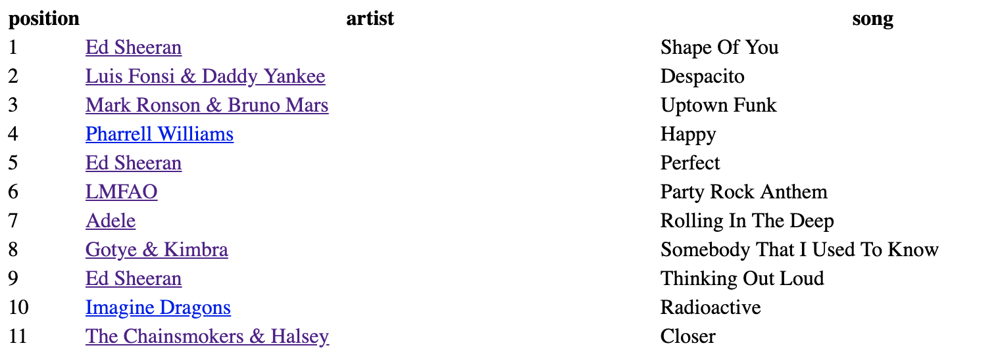
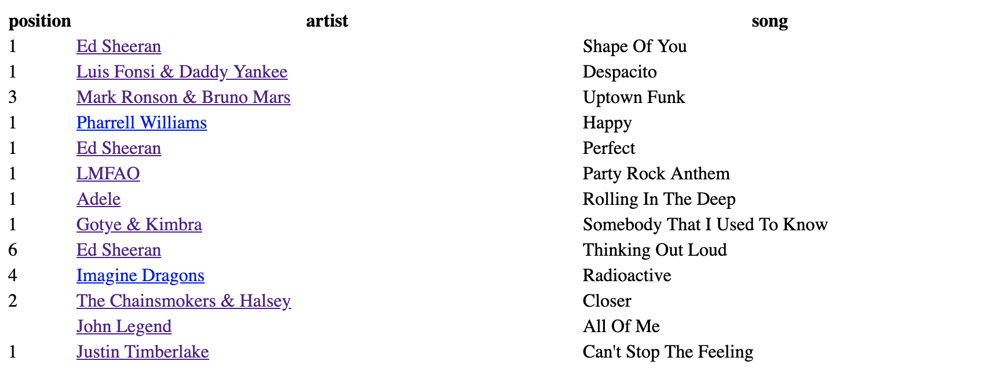
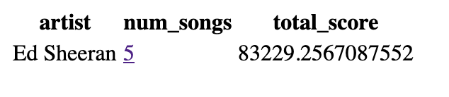

## Pivot Table Challenge

Using data found at [chart2000.com](https://chart2000.com/about.htm) create an webpage capable of returning the data in a table format of

| Artist | Song | Position Overall |
|--------|------|------------------|
| Ed Sheeran| Thinking Out Loud | 9 |

The user can apply filters:

Specify a country to modify the _Position Overall_ to _Position by Country_, i.e

| Artist | Song | Position in Denmark |
|--------|------|----------------|
| Ed Sheeran| Thinking Out Loud | 6 |

Specify an Artist

| Artist | Total Number of Songs |
|--------|-----------------------|
| Ed Sheeran | 5 |

User can click on any header to sort by that column of data. [Not Done]

### Extensions

Take more data from the chart2000 site and implement:
- a date range filter
- An aggregate for months/years
- limit the table to 20 rows and have pages
- option to view albums rather than songs

#### Stack
Node & Express

[Dotenv](https://github.com/motdotla/dotenv): Loads environment variables for Node
[Pg](https://github.com/brianc/node-postgres): PostgreSQL client for Node
[Pug](https://github.com/pugjs/pug) (formerly Jade): html template engine for Node
[Got](https://github.com/sindresorhus/got): Lightweight http request library

### API Routes

| Route | Returns |
|-------|---------|
| /songs | default data format (Artist \| Song \| Position) |
| /songs?country=[country] | return position on charts of specified country |
| /songs/artist?name=[artist name] | return number of songs by specified artist |

The API will has a single table containing data on the top 200 songs from the last decade. There are no models however a songsService module exists to handle requests to the database.

### Web Page

The Web App home route displays the top 200 songs of the decade, each value in the "Artist" column is a link to a page of aggregate data on that artist (songs with multiple artists will display aggregated data for songs involving all artists). A query string can be added to the home route to filter the "position" column by country, however this feature has not been added to the user interface.

#### Pages

All Songs:


Country Filter:


Artist Aggregate:



## Running The App

To get the api running you will need a `.env` file with PGHOST, PGUSER, PGDATABASE, PGPASSWORD and PGPORT. Create this file in `api/`. You will also need to create a database and populate it with the one of the csv files for top songs of the decade found at https://chart2000.com/about.htm

To populate the database run 

```sql
COPY songs FROM 'path/to/songs.csv' WITH (FORMAT csv, HEADER true, NULL "-", FORCE_NULL(us, uk, de, fr, au, ca));'
```

Run the api

```zsh
# in 'song-hits-challenge/'
$ cd api
$ npm install
$ npm dev start
```


Run the website

```zsh
# in 'song-hits-challenge/'
$ cd website
$ npm install
$ npm run
```

The site should now be running on localhost:4000.

### Tests

There are only integration tests for the api, no tests were written for the front end. Before running the tests you will need to change the path to the .csv file in the before hooks of each test. Create a test database and put the name into `api/test/.env.test` PGDATABASE variable, also changing the PGUSER variable to your own pg username. Finally run the tests with `npm test`.